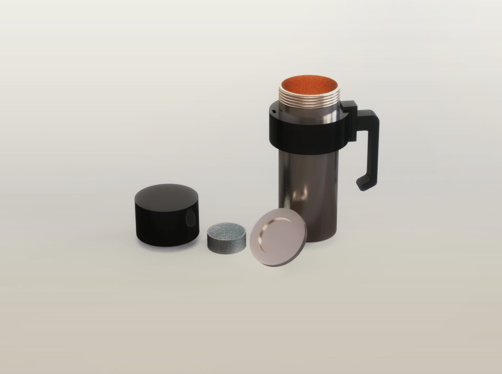
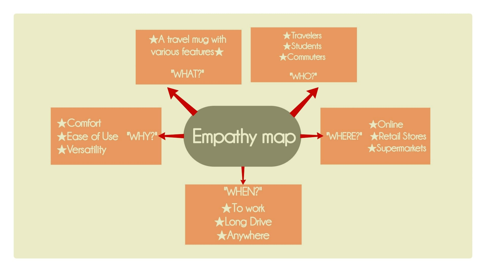
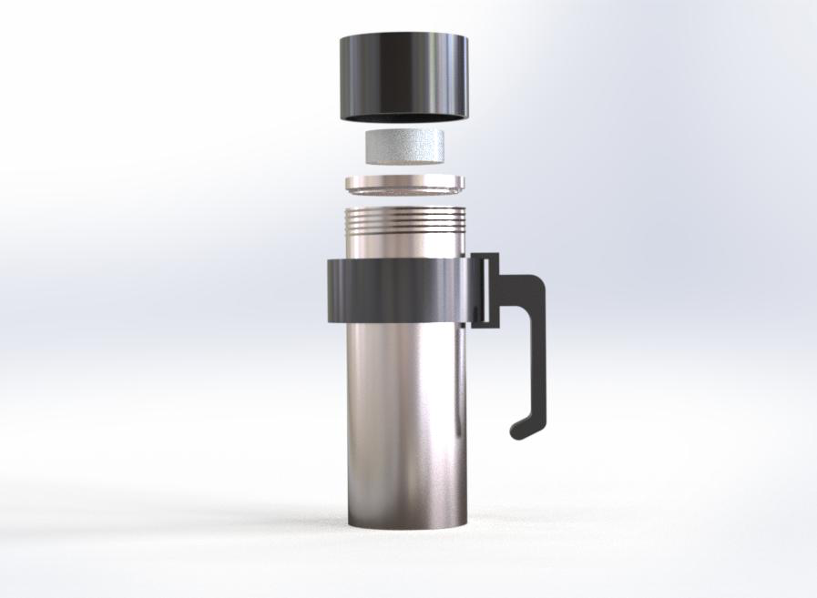
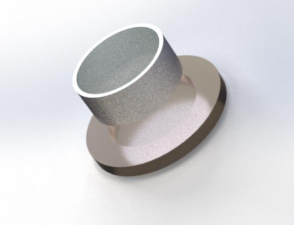
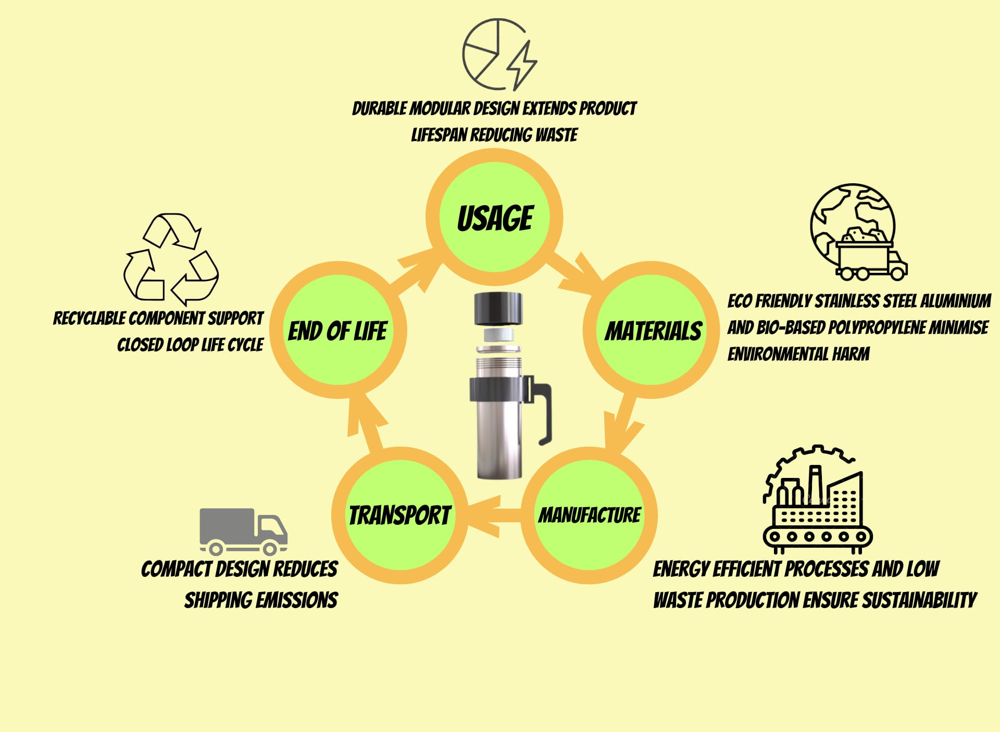
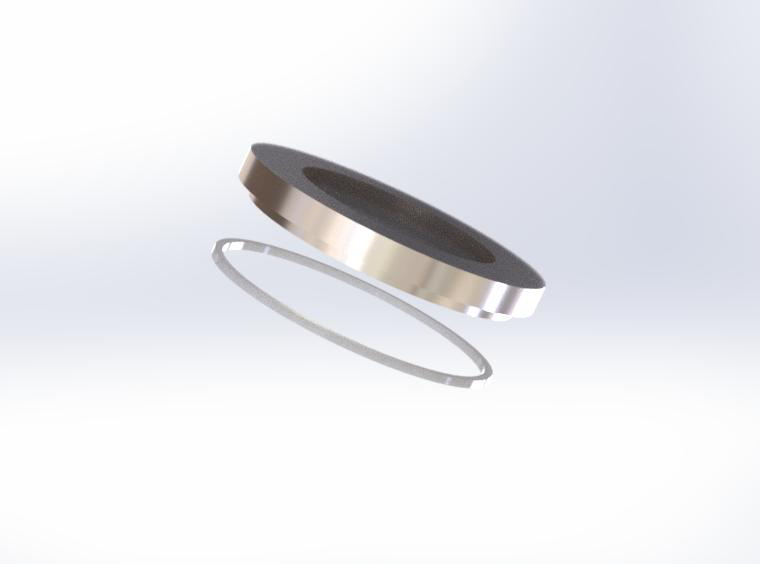
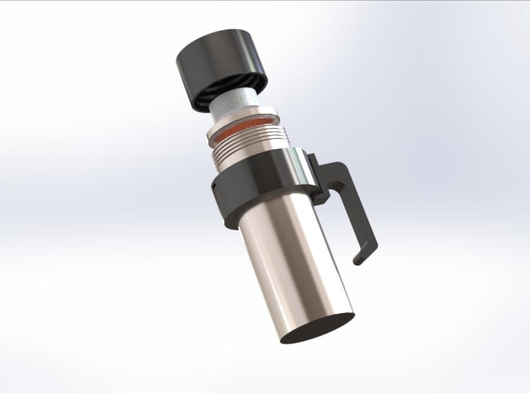

# OmniSip: Modular Drinkware Architecture

> **Engineered for Adaptability.** An industrial design case study for a multi-functional drinkware solution featuring custom modular attachments and an eco-conscious material framework.

| Fully Assembled OmniSip Travel Mug |
| :---: |
|  |

---

## 1. Executive Summary
With the passage of years, the demand for efficient functionality in products has increased proportionally. OmniSip represents a paradigm shift in portable drinkware engineering. A customisable travel mug with modular attachments serves as an innovative solution for the evolving needs of individuals with active, multifaceted lifestyles. Whether utilised for daily commuting, professional workplace settings, or outdoor activities, this product provides a highly feasible and robust solution for carrying beverages and essential items with maximum ease and practicality. By prioritising user convenience alongside sustainable manufacturing practices, this innovative concept encourages a lifestyle of eco-consciousness while catering directly to modern consumer demands.

---

## 2. The Problem Space & Market Opportunity
The current consumer market offers a wide range of travel mugs, but the vast majority fail to meet the continuously evolving needs of the modern consumer. Extensive market research and detailed empathy mapping identified several critical functional gaps in the contemporary drinkware sector:

* **Lack of Multi-functionality:** Almost all existing travel mugs are designed for the singular purpose of carrying beverages and fail to incorporate secondary practical functions, such as modular storage.
* **Portability Deficits:** A significant portion of existing travel mugs do not provide adequate portability features, such as a detachable handle for hands-free use while on the go.
* **Sustainability Concerns:** Modern consumers actively seek sustainable, eco-friendly products due to increased environmental awareness. Products manufactured utilising single-use plastics or non-recyclable components are seeing a decline in market reception.
* **Thermal Inefficiency:** Existing solutions frequently fail to keep beverages at the desired temperature for extended periods, especially when exposed to extreme environmental conditions.

From a business perspective, the opportunity to disrupt this space is massive. The global thermos drinkware market size was estimated at USD 3.09 billion in 2024 and is expected to grow at a Compound Annual Growth Rate (CAGR) of 6.7% from 2025 to 2030.

| User Empathy Map and Target Audience Analysis |
| :---: |
|  |

---

## 3. Modular Architecture & Component Engineering
The travel mug's modular architecture includes several practical and highly efficient features meticulously designed to streamline the user's daily carry and reduce the need to juggle multiple standalone items.

| Exploded View of Modular Components |
| :---: |
|  |

### Detachable Snack Compartment
The dimensions of the upper compartment are precisely 50 mm in diameter and 30 mm in height. This volumetric dimension is optimised for carrying small snacks for energy during travel. This compartment fits directly into the primary lid of the mug and is securely locked via a custom snap-fit mechanism. This provides accessible, on-the-go storage without compromising the mug's core aerodynamic profile.

| Detachable Snack Compartment Detail |
| :---: |
|  |

### Snap-Fit Handle Mechanism
The external handle is 130 mm long and 30 mm thick, making it proportional to the overall dimensions of the mug to ensure ergonomic weight distribution. The handle features a C-shaped hook that aligns with two specific openings on the stainless steel rim of the primary vessel. The handle's hook compresses slightly as it enters the primary openings and then snaps firmly back into place, ensuring a rigid, secure fit that prevents accidental detachment.

### Integrated Key Interface
A designated L-shaped opening in the outer rim creates dedicated space for key straps to be hung securely. This L-shaped geometry adds an extra layer of structural security by ensuring the keys stay locked in place, significantly reducing the risk of them falling off or getting lost during high-movement activities.

---

## 4. Material Science & Life Cycle Analysis (LCA)
Crafted from highly sustainable materials, the OmniSip design actively prioritises eco-friendliness. The careful selection of these materials directly supports a closed-loop life cycle, reducing waste from manufacturing through to the product's end of life.

| Circular Life Cycle Analysis (LCA) |
| :---: |
|  |

* **Body & Internal Framework (316 Stainless Steel):** The primary material chosen for the vessel is 316 stainless steel. This specific grade is highly durable, resistant to corrosion, and maintains structural integrity over long periods. The precise dimensions of the main mug body are 200 mm in length and 76 mm in width.
* **Modular Handle (Bio-Based Polypropylene):** The handle utilises Bio-Based Propylene, which is derived from renewable plant-based sources such as sugarcane or corn, rather than traditional fossil fuels. This significantly reduces the carbon footprint of the product. Furthermore, polypropylene offers exceptional flexibility and resistance to fatigue, ensuring the snap-fit mechanism remains reliable over thousands of cycles.
* **Snack Storage (Aluminium):** Because the primary requirement for the top compartment is a high strength-to-weight ratio, aluminium was selected as the ideal material. It provides a natural barrier to moisture, keeping stored snacks fresh without adding significant physical weight to the top of the mug.
* **Airtight Seals (Silicone Rubber):** The bottom section of the primary lid measures 68 mm in diameter and 20 mm in thickness. This is completely surrounded by a high-grade silicone rubber gasket measuring 72 mm in diameter, which forcefully locks the mug to guarantee it remains completely airtight and leak-proof.

| Silicone Gasket Seal Assembly |
| :---: |
|  |

---

## 5. Thermal Performance & Thread Design
The core functionality of the OmniSip relies on advanced thermodynamics and secure mechanical sealing. The double-walled vacuum insulation ensures that internal beverages remain isolated from external ambient temperatures. The system is engineered and tested to maintain beverage temperatures for a minimum of 6 hours for hot liquids and up to 12 hours for cold liquids. The lid features engineered threads that align perfectly with corresponding ridges on the rim of the mug, creating a tight interlocking seal when twisted.

| Internal Thermodynamics and Double-Walled Insulation |
| :---: |
|  |

---

## 6. Competitor Benchmarking
A direct feature comparison of the top travel mugs currently available on the commercial market highlights the unique, distinct value proposition of OmniSip's modular ecosystem.

| Feature | OmniSip Concept | Contigo | Hydro Flask | S'well | Yeti |
| :--- | :--- | :--- | :--- | :--- | :--- |
| **Material** | Stainless Steel | Stainless Steel | Stainless Steel | Stainless Steel | Stainless Steel |
| **Insulation** | 6 hrs hot, 12 hrs cold | 5 hrs hot, 12 hrs cold | 6 hrs hot, 24 hrs cold | 12 hrs hot, 24 hrs cold | 6 hrs hot, 12 hrs cold |
| **Modularity** | **Yes** | No | No | No | No |
| **Leak-Proof** | Yes | Yes | Yes | Yes | Yes |
| **Eco-Friendly** | **Bio-Based PP** | BPA-Free | BPA-Free | BPA-Free | BPA-Free |

---

## 7. Documentation & Portfolio
For a deeper dive into the initial conceptualisation, sketching phases, 3D printing rapid prototyping logic, and the complete industrial design methodology, view the full project documentation housed within this repository.

**[View Full Product Concept Portfolio (PDF)](docs/OmniSip.pdf)**

---
*Developed by Sri Vigneswaran under the [MIT License](./LICENSE)*